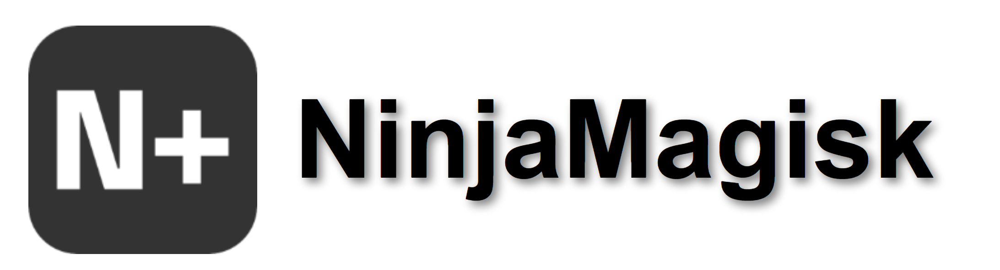

___
NinjaMagisk 是一个使用 C# .NET Framework 4.7.2 编写，并使用 Microsoft Visual Studio 2022 编译的跨平台动态链接库。它提供了多种功能模块，包括日志记录、文件操作、网络检查、Windows 系统配置、AI 集成等。

> [c2db0e9](https://github.com/Rainbow-SPY/NinjaMagisk/commit/c2fb0e9658cb6b951103b7c13369571f59944bd7#diff-9e1b2aa1e49fe5dd1128cc48315650e9479900b2facf0770776ba9705b07a514) 提交中在`Main.cs`中对全方法进行了\<summary\>注释添加,详情可以查看在Github 上的 [Main.cs](https://github.com/Rainbow-SPY/NinjaMagisk/blob/master/NinjaMagisk/Main.cs)
## 目录

1. [全局引用方法](#1-全局引用方法)
2. [日志](#2-日志)
3. [自定义下载](#3-自定义下载)
4. [安全软件检测](#4-安全软件检测)
5. [网络](#5-网络)
6. [Windows系统相关配置](#6-Windows系统相关配置)
7. [AI](#7-AI)
8. [文件](#8-文件)
9. [Windows身份验证](#9-Windows身份验证)
10. [检查更新模块](#10-检查更新模块)
11. [文本类处理](#11-文本类处理)
12. [API查询](#12-API查询)

## 1. 全局引用方法

NinjaMagisk 提供了多种引用方式，您可以根据需求选择合适的方式：

```csharp
using NinjaMagisk;
using static NinjaMagisk.LogLibraries;
using static NinjaMagisk.Windows;
```
## 2. 日志
### 控制台打印彩色日志
```csharp 
NinjaMagisk.LogLibries.WriteLog(LogLevel loglevel, LogKind logkind,string message);
NinjaMagisk.LogLibries.WriteLog(LogLevel loglevel,string message);
```

* **`LogLevel` 可用枚举:** `Info`,`Warning`,`Error`.
* **`LogKind` 可用枚举:** `Process`,`Task`,`Service`,`Registry`,`Network`,`PowerShell`,`Form`,`System`,`Thread`.

### 写入日志到文件

```csharp
NinjaMagisk.LogLibries.LogToFile(LogLevel loglevel,LogKind logkind, string message);
NinjaMagisk.LogLibries.LogToFile(LogLevel loglevel, string message);
```
调用此方法时,会在当前目录下创建`Assistant.log`日志文件,并会以下格式写入文件

 ```plaintext
 $"{DateTime.Now:yyyy-MM-dd HH:mm:ss} [{logkind}] [{logLevel}]: {message}";
 ```

### 清空日志

```csharp
NinjaMagisk.LogLibries.ClearFile(string filePath);
```

* **`filepath`:** 日志文件路径

## 3. 自定义下载

> [!NOTE]
> 使用时请注意,在无网络的情况下,`MessageBox`会弹出提示询问是否进行下一步操作.

```csharp
NinjaMagisk.DownloadAssistant.Downloader(string url);
NinjaMagisk.DownloadAssistant.Downloader(string url,string Downloadvocation);
NinjaMagisk.DownloadAssistant.Downloader(string url,string Downloadvocation,bool log);
NinjaMagisk.DownloadAssistant.Downloader(string url,string Downloadvocation,string outputName);
NinjaMagisk.DownloadAssistant.Downloader(string url,string Downloadvocation,string outputName,bool log);
```
* **`url`:** 下载链接

* **`Downloadvocation`**: 下载位置

* **`log`** : 是否启用日志输出

当`bool`为`true`时,日志会输出到`"{Directory.GetCurrentDirectory()}\\aria2c.log\`文件内,反之为`false`则不会.

* **`outputName`**: 文件的输出名称

文件下载完后会以`outputName`为命名储存在`Downloadvocation`文件夹内.

### 模块下载

```csharp
NinjaMagisk.DownloadAssistant.ModuleDownloader(Module module);
```

* **`Module`可用枚举:** `zip`,`VC`.

当您使用`Module.VC`下载微软常用运行库时,此文件会保存在 `%USERPROFILLE%\Appdata\Local\Temp`文件夹内.  

当您使用`Module.zip`下载7-zip组件时, 此文件会保存在`$"{Directory.GetCurrentDirectory()}\\bin"`文件夹内.
<br>

### 应用下载

```csharp
NinjaMagisk.DownloadAssistant.ApplicationDownloader(App app);
```
* **`App`可用枚举:** `EasiNote5`,`EasiCamera`,`SeewoService`,`WeChat`,`ToDesk`.

文件会保存在 `%USERPROFILLE%\Appdata\Local\Temp`文件夹内

## 4. 安全软件检测

```csharp
NinjaMagisk.Security.Anti360Security();
NinjaMagisk.Security.AntiHuoRongSecurity();
```

* **返回值:** `true` 表示安全软件正在运行，`false` 表示未运行。
## 5. 网络
### 网络可用性检查

```csharp
NinjaMagisk.Network.IsNetworkAvailable();
```

- **返回值:** `true` 表示网络可用，`false` 表示网络不可用。

## 6. Windows系统相关配置

> [!WARNING]
> 此操作可能需要高性能电脑，执行后可能会影响系统性能和安全。
### 启用/禁用休眠

```csharp
NinjaMagisk.Windows.Hibernate.Enable(); //启用休眠
NinjaMagisk.Windows.Hibernate.Disable(); //禁用休眠
```
### 启用卓越性能

```csharp
NinjaMagisk.Windows.EnableHighPowercfg(); //启用卓越性能
```
### 启用/禁用Windows 安全中心与Windows Defender

```csharp
NinjaMagisk.Security.WindowsSecurityCenter.Enable() //启用
NinjaMagisk.Security.WindowsSecurityCenter.Disable() //禁用
```
### 启用/禁用 Windows Update

```csharp
NinjaMagisk.Windows.WindowsUpdate.Enable() //启用Windows 更新
NinjaMagisk.Windows.WindowsUpdate.Disable() //禁用Windows 更新
```
### 激活 Windows

```csharp
NinjaMagisk.Windows.ActiveWindows(); //激活Windows
```

### 写入注册表

```csharp
NinjaMagisk.Registry.Write(string keyPath,string valueName,object valueData,RegistryValueKind valueType);
```

* **`keyPath`: 设定注册表路径**

* **`valueName`: 设定注册表项名称**

* **`RegistryKind`可用枚举:** `DWord`,`QWord`,`String`等,详细帮助请查看[官方界面](https://learn.microsoft.com/zh-cn/dotnet/api/microsoft.win32.registryvaluekind?view=net-8.0)

* **`valueType`:设定注册表项内数据类型**

* **`valueData`:设定注册表项内数据**
<br>

## 7. AI

### ChatGPT API引用

```csharp
NinjaMagisk.AI.ChatGPT.Chat(string text,string api); //ChatGPT API引用
```
* **`text`: 向 `api.openai.com/v1/completions` 发送的请求**

* **`api`: OpenAI Platform 网站申请的API**
<br>

### DeepSeek API引用

```csharp
NinjaMagisk.AI.DeepSeek.Chat(string text,string api); //DeepSeek API引用
```

* **`text`: 向 `api.deepseek.com/v1/completions` 发送的请求**

* **`api`: DeepSeek Platform 网站申请的API**

## 8. 文件

### AES加密/解密

> [!NOTE]
> 请妥善保管好您的`IV`算法初始化向量和您的`Key`密钥.

```csharp
NinjaMagisk.File.AESEncryption.Decrypt(string cipherText, byte[] Key /*256-bit*/ , byte[] IV /*128-bit*/ );//解密
NinjaMagisk.File.AESEncryption.Encrypt(string cipherText, byte[] Key /*256-bit*/ , byte[] IV /*128-bit*/ );//加密
```
* **`cipherText`: 要加密/解密的文本**
* **`key`: AES加密/解密密钥(256位)**
* **`IV`: AES加密/解密初始化向量(128位)**
<br>

### 文件属性修改

```csharp
NinjaMagisk.File.Attrib(string path, AtOp Key, bool Switch);
```

* **`path`: 文件的路径**
* **`AtOp`(Attrib Option) 可用枚举:** `System`(设置文件为系统文件),`Hidden`(设置文件为受保护的隐藏文件),`Readonly`(设置文件为只读),`Archive`(设置文件为可存档文件).
* **`Key`: 文件属性**
* **`Switch`: 启用或取消属性:** 设置为`true`时,给出的命令为`+r`(示例);设置为`false`时,给出的命令为`-r`(示例).

### MD5哈希值验证
```csharp
NinjaMagisk.File.CheckFileHash(string filePath, string expectedMD5);
```

* **`filePath`: 文件路径**
* **`expectedMD5`: 期望的MD5哈希值**
* **返回类型: `bool`**
* **返回值: 文件的MD5哈希值与期望的MD5哈希值相同时,返回`true`,反之则为`false`.**

### 获取文件MD5哈希值
```csharp
NinjaMagisk.File.CalculateMD5(string filePath);
```

* **`filePath`: 文件路径**
* **返回类型: `string`**
* **返回值: 文件的MD5哈希值**

## 9. Windows 身份验证

```csharp
NinjaMagisk.Windows.Authentication();
```
* **返回值:** `true` 表示验证成功，`false` 表示取消操作。

## 10. 检查更新模块
### 检查更新
```csharp
await NinjaMagisk.Update.CheckUpdate(string CheckUpdateUrl,Platform platform);
```

* **`CheckUpdateUrl`: 检查更新的API链接**
* **`Platform`可用枚举:** `Github`,`Gitee`.
___
 Github API规定的Release最新发行版查询地址为`https://api/github.com/repos/{用户名}/{仓库}/releases/latest`

 Gitee API规定的Release最新发行版查询地址为`https://gitee.com/api/v5/repos/{用户名}/{仓库}/releases/latest`

 返回的json中包含了最新发行版的信息，包括版本号、发布时间、下载地址等 例如,最新的版本号为 "tag_name": "v1.4","name": "新版本发布...."

 当检测出新版本时,会返回`true`,反之则为`false`,当Json解析错误时也会返回`false`.
 ___
 ### 自动更新
 ```csharp
 NinjaMagisk.Update.SelfUpdate(); // 自动更新
 ```
 * **返回类型:** `MessageBox`
 ___
规定 在压缩包内包含了 `update.ini` 和 `filehash.ini` 文件,以及更新文件     
___
规定 `Update_{version}.zip` 规格:
```
 压缩包文件目录:  
    Update_{version}.zip       // 更新文件压缩包    
    ├── update.ini             // 更新信息    
    ├── filehash.ini           // 文件哈希值        
    └── #(update files)        // 更新文件 
```
___
 规定 ``update.ini`` 规格:
```
    1 > version = ""                              // 版本号     
    2 > type = [Release / HotFix / bugFix]        // 更新类型       
    3 > description = ""                          // 更新说明        
    4 > updatefilecount = ""                      // 更新文件数量       
    5 > hashurl = ""                              // 哈希值文件下载地址       
    6 > hash = ""                                 // 文件数量 
```
___
 规定 ``filehash.ini`` 规格:
```
    > {fileName},{fileHash}         
示例: 
    1 > Library.dll,4CC1ED4D70DFC8A7455822EC8339D387
    2 > Library.pdb,FDFA7596701DCC2E96D462DBC35E7823
```           
## 11. 文本类处理
### 读取 / 写入配置文件
```csharp
NinjaMagisk.Text.Config.ReadConfig(string iniPath,string HeadText); //读取配置文件
NinjaMagisk.Text.Config.WriteConfig(string iniPath,string HeadText,string Value); //写入配置文件
```

* **`iniPath`:** 配置文件路径
* **`HeadText`:** 配置文件头部文本
* **`Value`:** 配置的值
* **返回类型:** `string`
* **返回值:** 返回配置文件头部文本对应的值
___
规定配置文件规格:
```plainText
    1> HeadText1 = value1
    2> HeadText2 = value2
    3> HeadText3 = value3
```
___
### Json反序列化
```csharp
NinjaMagisk.Text.Json.DeserializeObject<T>(string json);
NinjaMagisk.Text.Json.DeserializeObject(string json);
```

* **`json`:** Json字符串*
* **返回类型:** `<T>`  `<dynamic>`
* **返回值:** 返回反序列化后的对象
> 注： `<dynamic>` 已经包含在 DeserializeObject(string json) 方法中，因为返回类型是 `<dynamic>`，所以不需要额外的方法。
___
### Json序列化
```csharp
NinjaMagisk.Text.Json.SerializeObject(object obj);
```

* **`obj`:** 对象
* **返回类型:** `string`
* **返回值:** 返回序列化后的Json字符串
## 12. API查询

### Steam个人信息查询
```csharp
NinjaMagisk.API.SteamUserData(string steamID);
```

* **`steamID`:** SteamID,支持SteamID3,ID64,个人主页链接,自定义URL,好友代码
* **返回类型:** `Json`
* **返回值:** 返回Steam用户信息(可等待)
